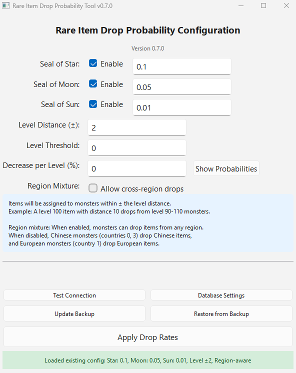

# Silkroad Online Database Tools



A GUI tool for managing the Silkroad Online database, specifically for configuring rare item drop rates.

## Rare Item Drop Probability Tool

A PyQt6 GUI application to configure drop rates for rare items (Seal of Star, Moon, and Sun).

### Features

- Configure drop probabilities for three rare item types:
  - **Seal of Star** (\*\_A_RARE items)
  - **Seal of Moon** (\*\_B_RARE items)
  - **Seal of Sun** (\*\_C_RARE items)
- Set individual probability for each type (e.g., 0.01 = 1%)
- Configure level distance for monster assignment
- Items drop from monsters within ± level distance of the item's required level
- **Automatic backup system**: Creates backup on first run to preserve original data
- **One-click restore**: Restore original drop table from backup
- **Real-time progress**: Shows exact progress percentage and ETA during operations
- **Database configuration**: Configure connection settings via GUI (saved to `db_config.json`)
- **Optimized performance**: Uses batch operations for fast processing (4+ hours reduced to minutes)

### Usage

1. **First Run** - Run the tool:

   ```bash
   uv run python main.py
   ```

   On first run, the tool will detect that no backup exists and ask if you want to create one. It's **highly recommended** to create this backup to preserve your original drop table.

2. **Configure Settings**:
   - Check the boxes for the rare types you want to enable
   - Enter the drop probability for each (0.01 = 1%, 0.005 = 0.5%, etc.)
   - Set the level distance (e.g., 10 means items drop from monsters ±10 levels)

3. **Database Settings** (if needed):
   - Click "Database Settings" to configure connection parameters
   - Settings are saved to `db_config.json` (excluded from git)
   - Default settings: localhost:1433, SRO_VT_SHARD, sa

4. **Test Connection** (optional):
   - Click "Test Connection" to verify database connectivity

5. **Apply Changes**:
   - Click "Apply Drop Rates" to update the database
   - The tool uses optimized batch operations for fast processing
   - Real-time progress shows percentage complete and ETA
   - Typical processing time: Minutes instead of hours

6. **Backup/Restore**:
   - **Create Backup**: Manually create/update backup of current drop table
   - **Restore from Backup**: Restore drop table to the backed-up state

### Example

If you set:

- Seal of Star: Enabled, 0.01 (1%)
- Level Distance: 10

The tool will:

1. Find all \*\_A_RARE items in the database
2. For each item (e.g., a level 100 sword), find monsters level 90-110
3. Assign the item to those monsters with 1% drop rate

### Backup System

The tool includes an automatic backup system for safety:

- **On first run**: The tool detects if no backup exists and prompts you to create one
- **Backup location**: Creates a table `_RefMonster_AssignedItemDrop_Backup` in the same database
- **Backup contents**: Complete copy of your original drop table
- **One-time backup**: The initial backup is only created once to preserve original data
- **Manual backup**: Use "Create Backup" button to update the backup at any time
- **Restore**: Use "Restore from Backup" button to revert all changes

The backup table persists in the database and won't be overwritten unless you manually create a new backup.

### Performance Optimizations

The tool uses several optimizations for fast processing:

- **Batch DELETE operations**: Deletes all old entries at once instead of one-by-one
- **Batch INSERT operations**: Inserts 500 rows per query instead of individual inserts
- **Memory-efficient processing**: Collects all assignments first, then processes in batches
- **Progress tracking**: Shows real-time progress with accurate ETA

**Performance comparison:**

- Old approach: Individual INSERTs could take 4+ hours for large datasets
- New approach: Batch operations typically complete in minutes

### Important Notes

- This tool will DELETE existing drop entries for the configured rare items before creating new ones
- Always ensure a backup exists before making changes
- The restore function will completely replace the current drop table with the backup
- If you want to preserve intermediate states, create manual backups before major changes
- Database configuration is stored in `db_config.json` (not tracked by git for security)

## Database Configuration

Database settings are stored in `db_config.json` and can be configured via the GUI:

**Default Settings:**

- Server: localhost
- Port: 1433
- Database: SRO_VT_SHARD
- User: sa
- Password: (empty - must be configured on first run)

**How to Configure:**

_Option 1: Via GUI (Recommended)_

1. Launch the tool: `uv run python main.py`
2. Click "Database Settings" button
3. Enter your database connection details
4. Click OK to save

_Option 2: Manual Configuration_

1. Copy `db_config.json.example` to `db_config.json`
2. Edit `db_config.json` with your database credentials
3. Launch the tool

**Security:**

- The config file is excluded from git (via `.gitignore`)
- Password is stored locally in `db_config.json`
- Never commit `db_config.json` to version control

## Installation

1. Clone the repository (if not already done)
2. Install dependencies:

   ```bash
   uv sync
   ```

3. Run the tool:

   ```bash
   uv run python main.py
   ```

4. Configure database settings on first run
5. Ensure your MSSQL database is running and accessible

## Development

### Versioning

The project version is maintained in **one place**: `pyproject.toml`

```toml
[project]
version = "0.1.0"
```

The application automatically reads the version from there using this priority:

1. Package metadata (via `importlib.metadata`) - for installed packages
2. `pyproject.toml` - for development mode
3. **Error** - if both fail, the application will not start

**Important**: Run `uv pip install -e .` after cloning to ensure version metadata is available.

### Database Schema

Key tables used by these tools:

- **\_RefObjCommon**: All game objects (items, monsters, NPCs)
  - ID: Object ID
  - CodeName128: Internal name
  - TypeID1, TypeID2, TypeID3, TypeID4: Object type classification
  - ReqLevel1: Required level for items

- **\_RefObjChar**: Character/monster properties
  - ID: References \_RefObjCommon.ID
  - Lvl: Monster level

- **\_RefMonster_AssignedItemDrop**: Drop assignments
  - RefMonsterID: Monster ID
  - RefItemID: Item ID
  - DropRatio: Drop probability (0.01 = 1%)

### Monster Identification

Monsters are identified by:

- CodeName128 starting with `MOB_`
- Example: `MOB_CH_MANGNYANG`, `MOB_CH_BIGEYEGHOST`

### Rare Item Patterns

- Seal of Star: \*\_A_RARE
- Seal of Moon: \*\_B_RARE
- Seal of Sun: \*\_C_RARE
